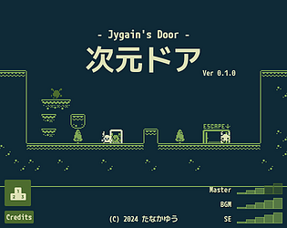
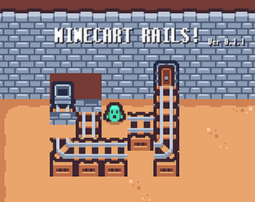
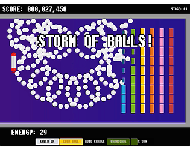
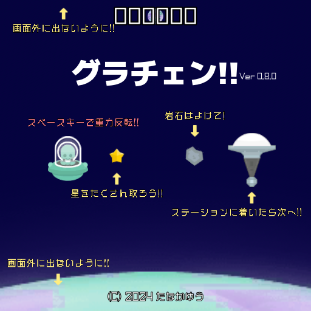
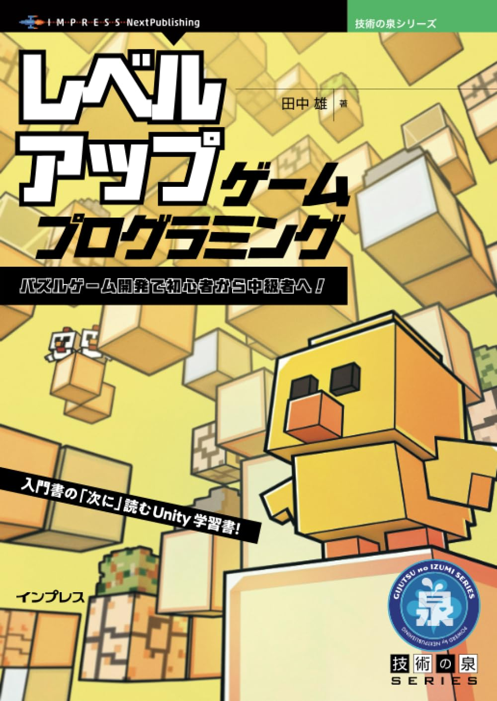
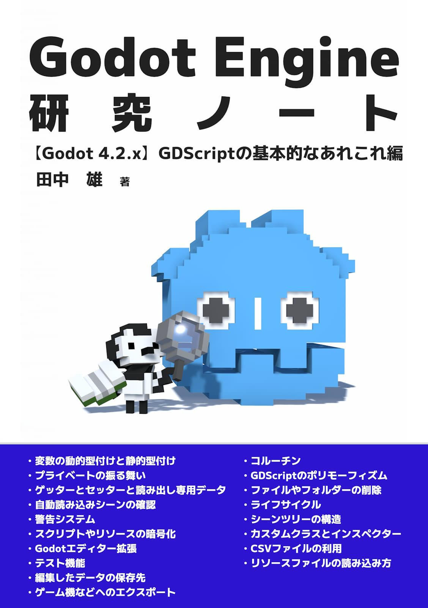

- 田中　雄
- 連絡先 Email [a@a.a](mailto:a@a.a)
- 専門学校デジタルアーツ東京 ゲームプログラムコース 2026年卒業予定

## スキル
- C#
  - 利用歴10年
  - Visual Studioで簡単なプログラムを開発可能
- Unity
  - 利用歴10年
  - オリジナルの個人/チーム作品の開発経験あり
- Godot Engine
  - 利用歴1年
  - オリジナルの個人作品の開発とゲームジャム参加経験あり

## 取り組んでいるテーマ

1. プログラミングの入門書籍の執筆
1. Unity用のひな型プロジェクトの開発
1. オリジナルのパズルゲームの開発

## 作品リスト

### 次元ドア

[次元ドア - Jygain's Door -](https://am1tanaka.itch.io/jygain-door)

次元の裏表を行き来できるドアを使って、次元嵐に飛ばされた仲間を救出するアクションパズルゲーム。

- 開発環境：Godot Engine 4.2
- 開発期間：2024/2/11-2/18
- [Brackeys Game Jam 2024.1](https://itch.io/jam/brackeys-11)参加作品
  - [Overall 6位](https://itch.io/jam/brackeys-11/results)

### Minecart Rails

[Minecart Rails](https://am1tanaka.itch.io/minecart-rails)

レースが乗ったブロックを押して、トロッコから出口まで、レールをつなげましょう！倉庫番的パズルゲーム。

- 開発環境：Godot Engine 4.3
- 開発期間：2024/7/20-8/31 + 2週間程度
- [Kenney Jam 2024](https://itch.io/jam/kenney-jam-2024)参加作品
  - [Honorable mentions 4位](https://itch.io/jam/kenney-jam-2024/results/honorable-mentions)

### STORM OF BALLS

[STORM OF BALLS](https://am1tanaka.itch.io/storm-of-balls)

クリッカーゲーム要素を加えた、パワーアップブロック崩しゲーム。

- 開発環境：Godot Engine 4.3
- 開発期間：2024/9/10-9/16 + 2週間
- [Brackeys Game Jam 2024.2](https://itch.io/jam/brackeys-12)参加作品

### グラチェン！

[グラチェン！](https://godotplayer.com/games/grachan)

画面の上下にある惑星の重力を切り替えて、UFOをステーションに導くワンキーアクションゲーム。

- 開発環境：Godot Engine 4.2
- 開発期間：2024/6/24-6/28
- [Godotでゆるっとゲーム制作祭](https://godotplayer.com/gamejams/2)参加作品

### レベルアップ・ゲームプログラミング　パズルゲーム開発で初心者から中級者へ！

[レベルアップ・ゲームプログラミング　パズルゲーム開発で初心者から中級者へ！](https://nextpublishing.jp/book/17752.html)

書籍やブログのチュートリアルを終えたものの、オリジナルゲームが作れないという人に向けたレベルアップ本。パズルゲームに登場するブロックに注目して、設計から実装までの具体的な資料や考え方を掲載。

- 発行日：2024/5/17
- 発行社：インプレス NextPublishing
- ページ数：102

### Godot Engine研究ノート２

[Godot Engine研究ノート２](https://techbookfest.org/product/4TTGRqssf60xCYKEEmNrQp?productVariantID=p5AtpL8eeWJQADewCMZYUV)

Godot Engineの利用歴半年の著者が、ゲームジャムに参加するゲームを開発中に気づいたり、調べたことをまとめたTips本。

- 発行日：2024/11/2(技術書典17)
- 発行社：自費出版
- ページ数：112

### Godot Engine研究ノート

[Godot Engine研究ノート](https://techbookfest.org/product/6xGjZaEjFH5DMV075xdpEn?productVariantID=L5ULDkScApgmbsvSM7RZv)

はじめてGodot Engineでゲームジャムのためのゲームを開発した著者が気づいたり、調べたことをまとめたTips本。

- 発行日：2024/5/25(技術書典16)
- 発行社：自費出版
- ページ数：72

## 連絡先
- ブログ [tanaka's Programming Memo](https://am1tanaka.hatenablog.com/)
- X [@am1tanaka](https://twitter.com/am1tanaka)
- E-mail [a@a.a](mailto:a@a.a)
